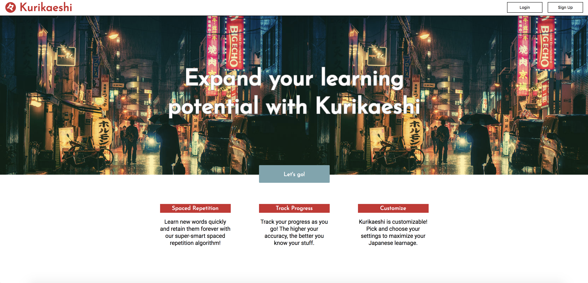

# <a href="https://kurikaeshi.netlify.com/">Kurikaeshi</a>
Kurikaeshi (Japanese for 'repetition') is an app allowing users to learn and retain Japanese vocabulary by means of a spaced repetition algorithm. Kurikaeshi stores a wealth of information, including pronunciation and example usages, for each word, and tracks the user's progress as their grasp of new vocabulary words increases.

## Demo Account:
User: demo_user1
Pass: password

## User Stories
Users can...

### Account Management
* Sign up for an account
* Log in to their account
* Log out

### Vocabulary
* Test knowledge of vocabulary by answering multiple choice questions
* View four different orthographic representations of every Japanese word
* Toggle hiragana/katakana/romaji to suit needs
* View each word used in context
* Track development of familiarity with a term by means of calculated accuracy percentage
* Access dictionary entries for missed words

## Wireframe

## Live Site Screenshots

## Techs
### Database
* Mongo
* Mongoose

### Back-end
* Node.js
* Express
* Passport

### Front-end
* HTML
* CSS
* JavaScript
* React
* Redux

### Testing, Deployment & CI
* Mocha
* Chai
* Heroku
* Netlify
* Travis CI

## Collaborators
<a href="https://github.com/adpoyao">@adpoyao</a>, <a href="https://github.com/nateusmc">@nateusmc</a>, <a href="https://github.com/zizify">@zizify</a>
